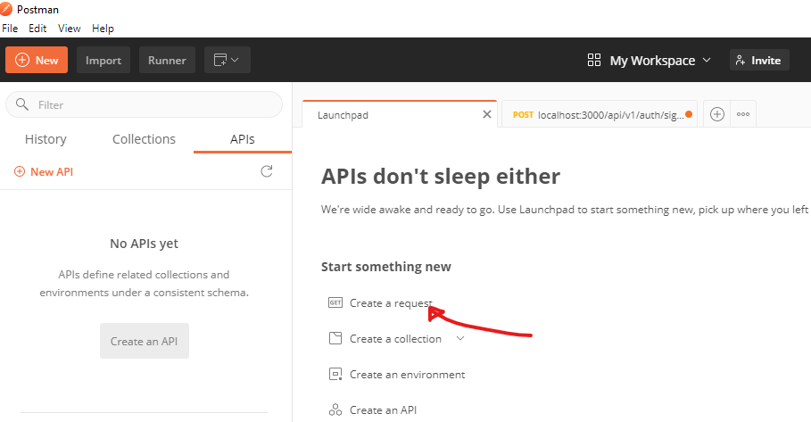

FORMAT: v1

# Consulter

Consulter is a simple API that creates meeting appointment(s) with a consultant from the available dates and time.

## Allowed HTTPs requests:

<strong>PUT </strong>    : To create resource  
<strong>POST</strong>    : Update resource 
<strong>GET</strong>     : Get a resource or list of resources 
<strong>DELETE</strong>  : To delete resource 

## Description Of Usual Server Responses:

<ul>
<li>200 OK - the request was successful (some API calls may return 201 instead).</li>
<li>201 Created - the request was successful and a resource was created.</li>
<li>204 No Content - the request was successful but there is no representation to return (i.e. the response is empty).</li>
<li>400 Bad Request - the request could not be understood or was missing required parameters.</li>
<li>401 Unauthorized - authentication failed or user doesn't have permissions for requested operation.</li>
<li>403 Forbidden - access denied.</li>
<li>404 Not Found - resource was not found.</li>
<li>405 Method Not Allowed - requested method is not supported for resource.</li>
</ul>

## Get Started

1. To get started using this API, you need an API Key

2. To get the Key, you need to sign up using any REST Client application eg. Postman. This documentation focuses on 
using Postman. If you don't have Postman installed, then you can download it from this link: <a href="https://www.postman.com/downloads/">Postman</a>

3. Once you download Postman and have it installed on your system, Open it up. Once open, you will see a link called
'Create a request'. (see the image below)

4. It will open a new tab to the right, now there are several steps to take as described from the image below:

Follow the numbers: 
 <ol start="1">
 <li>Click the down arrow and select POST</li>
 <li>Enter this URL: http://localhost:3000/api/v1/auth/signup</li>
 <li>Make sure you choose 'Body'</li>
 <li>Select JSON as your type</li>
 <li>Choose 'raw'</li>
 <li> Copy this code below and enter on the area numbered 6, and change the details to your own
 
    {
      "user": {
          "email": "emmanuel@emmanuel.com",
          "username": "ejoka",
          "password": "tanzania"
      }
    }
</li>

 </ol>
