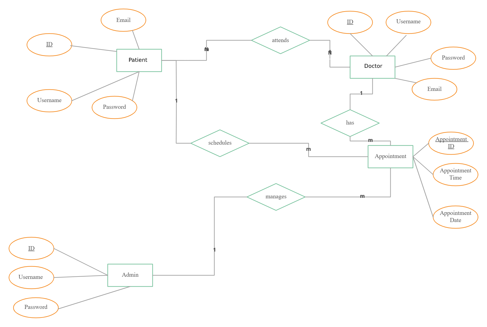

# Backend Final Project: Meeting Appointment

The project is based on an app to book an appointment for consultation with a Doctor. A patient can sign up and see selected dates and times for creating a consultation appointment with a Doctor. The Patient can then be able to edit, update dates and times and also delete an appointment. This is simply an API that can be used to create data for different patients.

## Built With

- Ruby on rails 6.0.3
- RSpec

## Documentation

[Documentation of the API](https://documenter.getpostman.com/view/12161529/TVCiTRdm#d8e3a480-62ea-4c81-972b-b3569fb0dbf4/)

## Getting Started

Open your terminal or text editor and use next command

        git clone https://github.com/emmanuelkamala/consulter.git

        cd consulter

        Run 'bundle install' command to install package dependencies.

## Set up the database
After running 'bundle install', you need to run migrations to create the database tables. On the console run these commands in order:

        rails db:setup

        rails db:migrate

## Run the app

To run the app and test the project; 
You will need a REST Client to test the endpoints. And for that I will recommend [Postman](https://postman.com/).

After downloading postman and installing it, then go to the root of the app enter this command on the command line:
'rails start'

Then open postman and use this link to start accessing the app:
http://localhost:3000/

After if you want to do any changes please create new branch, after changes open pull request.
Happy coding! 

## Author

👤 **Author1**

- Github: [emmanuelkamala](https://github.com/emmanuelkamala)
- Twitter: [ejkamala](https://twitter.com/ejkamala)
- Linkedin: [emmanuelkamala](https://linkedin.com/in/emmanuelkamala)

## 🤝 Contributing

Contributions, issues and feature requests are welcome!

Feel free to check the [issues page](issues/).

## Show your support

Give a ⭐️ if you like this project!

## Acknowledgments

- The odin project
- Microverse tips

## 📝 License

This project is [MIT](lic.url) licensed.
